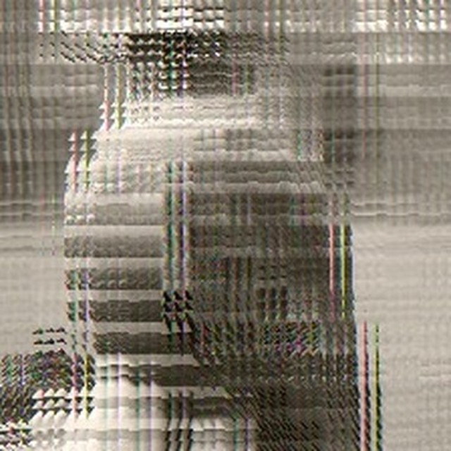
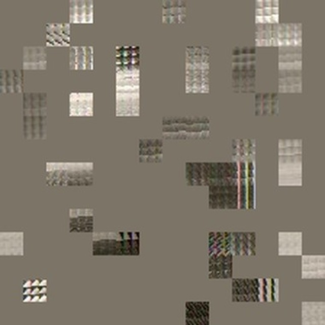
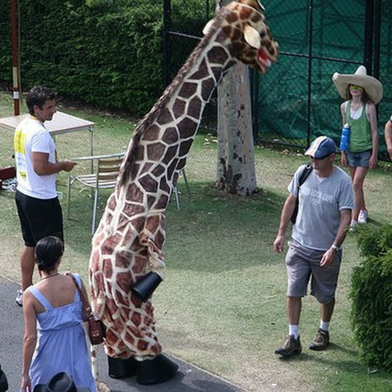
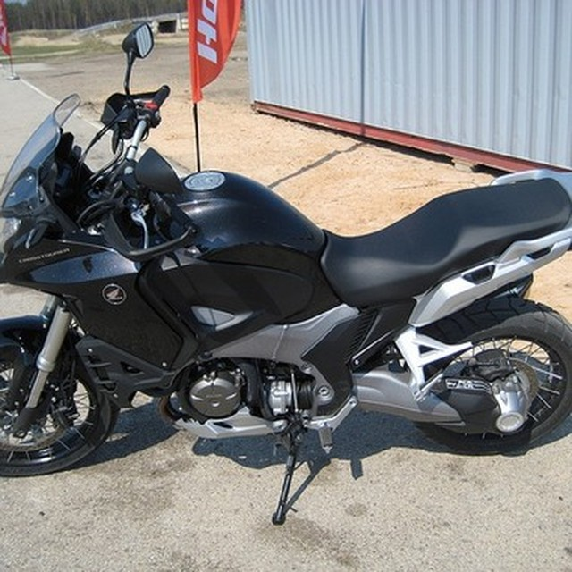
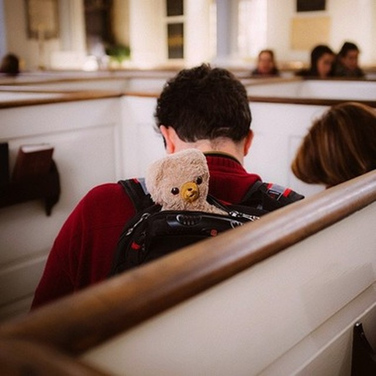
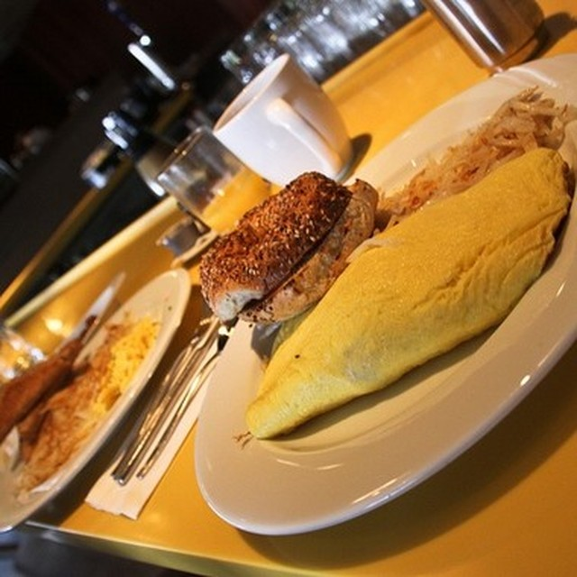
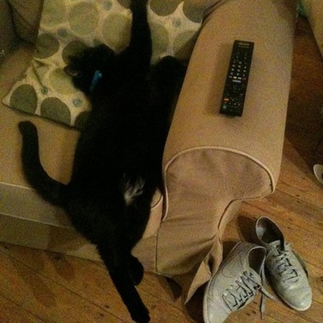
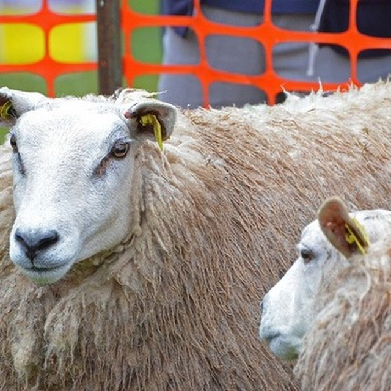

# VisionLang


A study of **LLaVA-style VLM training, evaluation, hallucination diagnosis,
and GRPO alignment** (ViT-B/16 + MLP projector + Qwen2.5-3B + LoRA).

## About
- Phase 1 · Self-supervised representation & retrieval:
  - MAE self-supervised pretraining on unlabeled ImageNet100, with linear-probe
    transfer evaluation;
  - FLAVA / CLIP zero-shot image-text retrieval and an MAE-initialized
    dual-encoder alignment model.
- Phase 2 · 0.5B VLM:
  - A controlled 3-initialization (random / MAE / CLIP) × 3-seed matrix showing
    CLIP > MAE >> random;
  - Data-scaling curves, LR robustness, CHAIR hallucination evaluation, and a
    text-only baseline.
- Phase 3 · 3B scaling & standard benchmarks:
  - Same architecture with Qwen2.5-3B + LoRA; two-stage SFT on OK-VQA
    (3 seeds = 0.179 ± 0.027);
  - GQA testdev_balanced as a second benchmark, plus POPE hallucination
    evaluation and object-level error analysis.
- Phase 4 · Alignment:
  - A balanced yes/no chain that fixes the class-imbalance policy collapse;
  - GRPO transferred to open-ended OK-VQA (rule reward + within-group advantage
    normalization + KL constraint): held-out 0.202 → 0.207, full 0.2095 → 0.2299.

**Environment**

- Hardware: single RTX 4090D (24 GB); peak VRAM 21 GB for 3B training;
- Software: Python 3.12, PyTorch 2.8, CUDA 12.8, transformers 4.57;
- Models: frozen ViT-B/16 (CLIP / MAE init) + 2-layer MLP projector +
  Qwen2.5-3B + LoRA (r=64, α=128).

## Datasets

| Dataset | Used for | Link |
| :--- | :--- | :--- |
| COCO2017 | captioning, image-text retrieval, POPE construction | [cocodataset.org](https://cocodataset.org) |
| ImageNet100 | MAE self-supervised pretraining | [image-net.org](https://www.image-net.org) |
| OK-VQA | open-ended VQA SFT & evaluation | [okvqa.allenai.org](https://okvqa.allenai.org) · [lmms-lab/OK-VQA](https://huggingface.co/datasets/lmms-lab/OK-VQA) |
| GQA | standard QA benchmark | [cs.stanford.edu/people/dorarad/gqa](https://cs.stanford.edu/people/dorarad/gqa/) |
| POPE | hallucination evaluation | [lmms-lab/POPE](https://huggingface.co/datasets/lmms-lab/POPE) |

## Models

All final trained checkpoints are published on Hugging Face:
[Luanneee/VisionLang](https://huggingface.co/Luanneee/VisionLang).
Base LLMs are loaded from `Qwen/Qwen2-0.5B` and `Qwen/Qwen2.5-3B`.

| Model | Description |
| :--- | :--- |
| vlm-3b-okvqa-sft | 3B OK-VQA two-stage SFT (3 seeds = 0.179 ± 0.027) |
| vlm-3b-okvqa-grpo | GRPO-aligned open-ended OK-VQA (full 0.2299 / held-out 0.207) |
| vlm-3b-okvqa-qabal | Balanced yes/no model (fixes policy collapse; POPE) |
| vlm-0.5b-clip-captioning | 0.5B COCO captioning (CIDEr 1.020, held-out test) |
| vlm-0.5b-qa-clip | 0.5B recognition / POPE evaluation (random 0.83) |
| mae-imagenet100-tiny | MAE self-supervised pretrained encoder |
| retrieval-coco2017-v2 | Image-text retrieval dual encoders (3 inits × 3 seeds) |
| visionlang-checkpoints | Full archive: all 0.5B / 3B seeds, ablations & datasets |

## Cases

### MAE Reconstruction

| Input | Masked (75%) | Reconstruction |
| :---: | :---: | :---: |
|  |  |  |
| input image | 75% masked patches | reconstructed output |

### Captioning (COCO2017 held-out test)

| Case 1 | Case 2 | Case 3 |
| :---: | :---: | :---: |
|  |  |  |
| "A man and a woman are standing near some giraffes." | "A man riding a surfboard on top of water." | "A large clock tower towering over a city." |

### OK-VQA Open-Ended QA

| Case 1 | Case 2 | Case 3 |
| :---: | :---: | :---: |
|  |  |  |
| What sport can you use this for? → motorcross | Name the type of plant this is? → succulent | What toy is this? → teddy bear |

### POPE Hallucination Cases

| Correct positive | Correct negative | Hallucination |
| :---: | :---: | :---: |
|  |  |  |
| spoon → yes (present) | dining table → no (absent) | parking meter → yes (absent, false positive) |

### GRPO Before / After (disjoint held-out split)

| Case 1 | Case 2 | Case 3 |
| :---: | :---: | :---: |
|  |  |  |
| Why might someone go to this place? — SFT / GRPO: business / business | What kind of event would these animals be at? — SFT / GRPO: sheep show / sheep show | Which model plane is this? — SFT / GRPO: 747 / 747 |

## Repository Structure

```text
VisionLang/
├── torchmultimodal/                 # multimodal model zoo (MAE, FLAVA, CLIP, ...)
├── examples/
│   ├── multimodal_llm/              # VLM training & evaluation
│   │   ├── train.py                 # two-stage SFT training
│   │   ├── eval_okvqa.py            # OK-VQA evaluation
│   │   ├── eval_gqa.py              # GQA evaluation
│   │   ├── eval_pope.py             # POPE hallucination evaluation
│   │   ├── grpo_okvqa.py            # open-ended GRPO alignment
│   │   └── chain_*.sh               # idempotent experiment pipelines
│   └── representation_learning/     # self-supervised representation & retrieval
│       ├── mae_pretrain.py          # MAE self-supervised pretraining
│       ├── mae_linear_probe.py      # representation transfer evaluation
│       └── flava_retrieval.py       # image-text retrieval
├── tests/                           # unit tests
├── outputs/                         # multi-seed metrics, POPE summaries, GRPO traces
├── data/                            # COCO2017 train / eval manifests
├── checkpoints/                     # MAE pretrained weights
└── README.md
```

## Acknowledgements

This project is built on
[facebookresearch/multimodal](https://github.com/facebookresearch/multimodal.git)
(TorchMultimodal, BSD-3-Clause).
